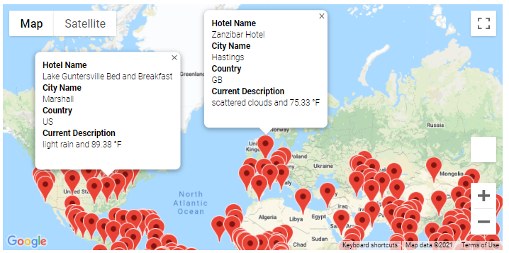
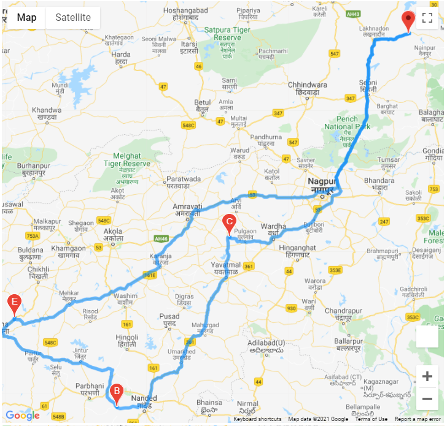
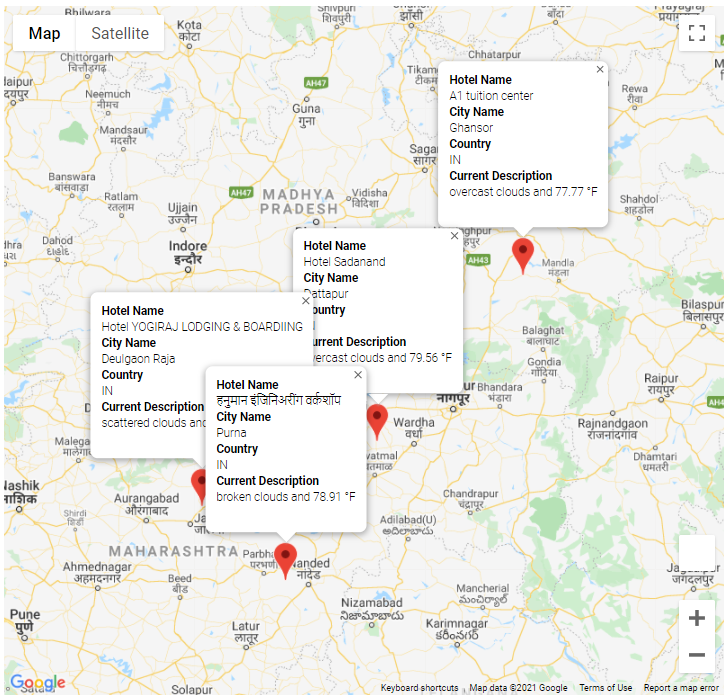

# WeatherPy with Python APIs: Picking vacation destinations based on weather criterion

## Overview
Company PlanMyTrip seeks to help would-be travelers plan vacations, suggesting cities destinations with available hotel accommodations.  Jack, the head of analysis at the company, asked me to collect and present weather data to potential customers that they can then filter to create their ideal vacation.  Eventually, customers should be able to filter cities based on temperature, choose cities with hotels as destinations and view a travel map showing all destinations.

## Tools
- `python` 3.7 using `pandas`, `numpy`, `citipy`, `requests`, `gmaps`, and `sys`
- `jupyter notebook`
- OpenWeatherMap (APIs)
- Google Maps for Javascript, Places, Directions (APIs)

## Deliverables
### section 1
- [Code](Weather_Database/Weather_Database.ipynb)
- [Data](Weather_Database/WeatherPy_Database.csv)

### section 2
- [Code](Vacation_Search/Vacation_Search.ipynb)
- [Data](Vacation_Search/WeatherPy_vacation.csv)
- 

### section 3

- [Code](Vacation_Itinerary/Vacation_Itinerary.ipynb)
- 
- 
